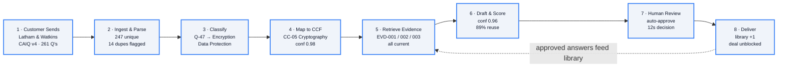

# TrustReply

**Harvey AI's Trust Intelligence Platform — interactive demo.**

A working React app that walks through how a Customer Trust function could ingest a security questionnaire, map every question to a Common Control Framework, retrieve current evidence, draft an answer, and route it to a human reviewer — all grounded in a Snowflake-style data model.

Built as a portfolio piece for **Josh McKibben**, joining Harvey AI as Head of Trust, by **Saurabh Jhaveri** (Data Product Manager · 13+ yrs in BI / data products).

> **Why this exists.** Josh's brief was: *"Build something we can interact with. Think about it as a compliance data lake — what tables, what schema, what views. Think about the reports. Maybe even an AI agent."* This is my answer.

---

## Try it

| | |
|---|---|
| **Live demo** | _coming soon — add Vercel URL after first deploy_ |
| **Source code** | [github.com/saurabhj1986/trustreply-demo](https://github.com/saurabhj1986/trustreply-demo) |
| **Local dev** | `npm install && npm run dev` |

---

## What's in the demo

Four tabs, each answering a piece of Josh's brief:

1. **Trust Dashboard** — KPIs (audit readiness, evidence currency, questionnaire throughput, response time, reuse rate), customer questionnaire tracker with real Harvey customer names (Latham & Watkins, Allen & Overy, HSBC Legal, KKR, Paul Weiss, Bridgewater), and a 16-control Common Control Framework grid. **Plus an interactive 8-stage pipeline walkthrough** at the top — click any stage to see exactly what TrustReply does to a single question end-to-end, with sample data, the SQL behind it, and why it matters.
2. **TrustReply Agent** _(coming next)_ — interactive chat where Josh can ask security questions and watch the agent classify → map to controls → retrieve evidence → draft → score in real time, with a side-by-side reasoning panel.
3. **Data Model** _(coming next)_ — Snowflake-style DDL and sample rows for `control_inventory`, `evidence_submissions`, and `questionnaire_responses`, plus the "why this table?" rationale for each.
4. **How I Built This** _(coming next)_ — design decisions, the questions I'd ask Josh, my honest knowledge gaps, and an FAQ. The product-thinking tab — and the most important one.

---

## The 8-stage pipeline (the headline feature)

This is what Josh sees first when he opens the demo. One real customer (Latham & Watkins, CAIQ v4, 261 questions) traced from inbox to delivery, with one specific question — *"How does Harvey encrypt customer data at rest and in transit?"* — followed through every stage.



In the live app, every stage is clickable. Hover for a payload preview, click for the full inspector panel showing *what happens here*, *behind the scenes* (the SQL or LLM call), *sample data flowing through*, and *why this matters* (with a citation back to Josh's slides where relevant).

---

## Tech stack

| Layer | Choice | Why |
|---|---|---|
| Frontend | React 19 + Vite + Tailwind v4 | Fast scaffold, zero config, deploys to Vercel in one click |
| Icons | lucide-react | Consistent, tree-shakeable, no SVG sprite hell |
| Fonts | DM Sans · Source Serif 4 · JetBrains Mono | Professional but not corporate. Serif headings = trust |
| Data | Mock JS files in `src/data/` | v1 doesn't need a backend. Real data loader can swap in later |
| Persistence (planned) | Supabase (free tier) | Postgres + auth + storage. Wired up only when the demo earns it |
| Hosting | Vercel (Hobby / free tier) | Auto-deploys on every push to GitHub |

**Important: this is a demo.** All data is mocked. No real Harvey systems are connected. The customer names are real Harvey customers (publicly known) but all questionnaire details, dates, evidence IDs, and the analyst "Maya Chen" are invented for the walkthrough.

---

## Data model (preview)

The full DDL lives in the **Data Model** tab in the app. The three tables that anchor everything:

- **`control_inventory`** — Harvey's Common Control Framework. The single source of truth. Every framework Harvey holds (SOC 2, ISO 27001, etc.) maps back to these 16 control families. *Test once, audit many.*
- **`evidence_submissions`** — every artifact (config screenshot, policy doc, audit log, access review) attached to a control, with a `collected_date` and an `expires_date`. The lifecycle tracking is what prevents the audit-time scramble.
- **`questionnaire_responses`** — every customer security questionnaire, with completion rate, reuse rate, and response time. Powers the dashboard KPIs and feeds the reuse library.

---

## Run it locally

```bash
git clone https://github.com/saurabhj1986/trustreply-demo.git
cd trustreply-demo
npm install
npm run dev
# → http://localhost:5173
```

Build for production:

```bash
npm run build
npm run preview
```

---

## Roadmap

- [x] Tab 1 — Trust Dashboard with KPIs, questionnaire tracker, control grid
- [x] Interactive 8-stage pipeline walkthrough
- [ ] Tab 2 — TrustReply Agent (chat + reasoning panel)
- [ ] Tab 3 — Data Model viewer with DDL and sample rows
- [ ] Tab 4 — How I Built This (decisions / questions / gaps / FAQ)
- [ ] Vercel deployment
- [ ] _(stretch)_ NotebookLM-narrated walkthrough video embedded in the README

---

## About the author

**Saurabh Jhaveri** — Data Product Manager. 13+ years building BI and data platforms across finance and tech. Currently exploring the security/compliance space. I'm not from a traditional security background — my angle is *I can ship the data + product layer, the security domain knowledge I'll learn on the job.* This demo is the proof.

---

_Built April 2026._
